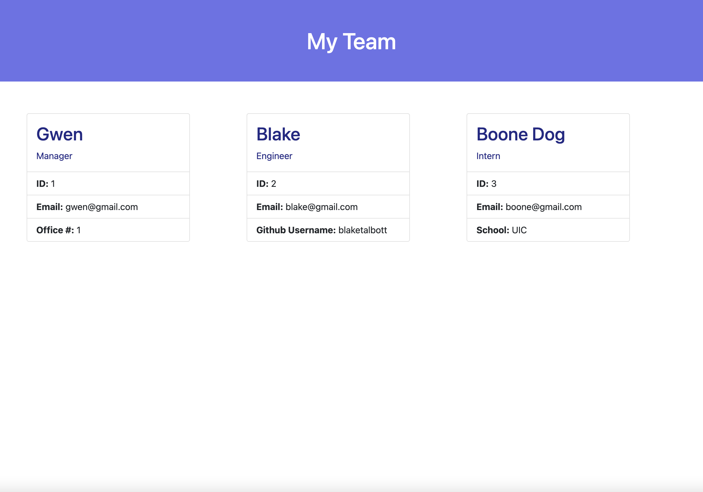

# 10 Team Profile Generator

## Description

My team profile generator is an application which generates an html file with employee profile cards that the user adds with pertinant information for a manager, engineer and an intern.

When the user deploys the application they are asked to add a team member, when they choose they are prompted to add the name, id number and email address of that employee. If they chose a manager, they will also be prompted to add an office number, if they choose to add an engineer, they will be prompted to add thier Guthub username, and if they choose an intern, they will be prompted to add what school they attend.

After one employee profile is complete, the user is prompted to add more team members, if they add more, they will be taken back to the beginning where they can choose who they want to add, and then they will fill in the prompts of the employee they chose. When the user is done adding employees, at the end they will choose "No, I'm done." which will end the program and generate a "team.html" file in the project root folder which they open in thier default browser and can see all the employee profiles they added.

## Technology Used

- HTML
- CSS
- JavaScript
- Node.js
- Inquirer
- Jest

## Screenshot

## Walkthrough Video

## Link

- [Here is my repo](https://github.com/gwenewasko/Employee-Profile-Generator)
